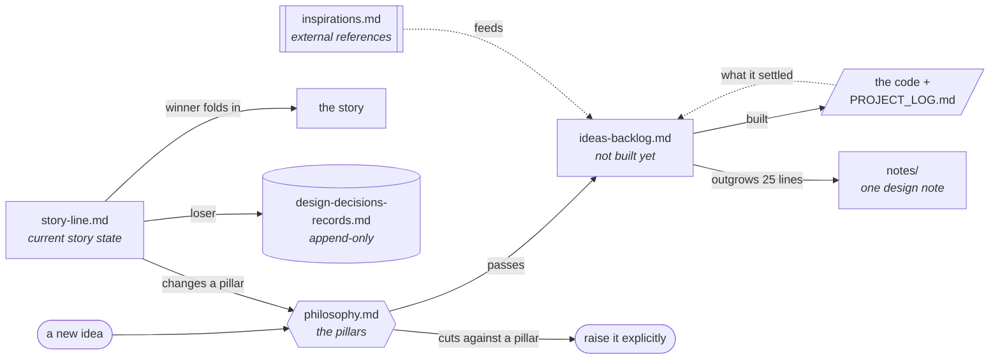

# Game design

The design documentation, split by lifecycle. Each file holds one kind of
content, and content *moves* between them as its status changes — the rules of
movement are the contract.

| File | Holds | Moves |
|---|---|---|
| [philosophy.md](philosophy.md) | Design pillars — what this game is trying to be | Changes rarely; when a decision changes a pillar, update it and record why in [design-decisions-records.md](design-decisions-records.md) |
| [story-line.md](story-line.md) | The **current state** of the story: live candidates, preferences, open decisions | When a story decision lands, the winner folds into the story (and its pillar consequences into philosophy.md); losers move to design-decisions-records.md with the why |
| [ideas-backlog.md](ideas-backlog.md) | Not-yet-implemented ideas, checked against philosophy.md before entering | When implemented, **delete the entry** — the implementation plus `../PROJECT_LOG.md` is the record from then on. Keep only whatever part is still open |
| [design-decisions-records.md](design-decisions-records.md) | Decision records: what was decided, what was rejected, and why | Append-only; entries never leave |
| [inspirations.md](inspirations.md) | External references (games, design writing) with the specific lesson each carries, and which backlog entry it feeds | Entries stay after the idea they fed ships — unlike backlog entries — since "why is it shaped like this" outlives the shipping |
| [notes/](notes/) | One design note per file, for anything that outgrows a backlog entry | Written when a backlog entry gets too long to skim; the entry keeps its summary and links here |

Related, outside this folder: [`../PROJECT_LOG.md`](../PROJECT_LOG.md) is the
chronological history (what happened, when); the records file here is the
decision-shaped view of the same events (what was chosen, against what, why).
An idea that cuts against a pillar is a reason to discuss it explicitly
(with hooman) rather than add it silently — same rule as always.

## What exists today

The biomes that are built, and what makes each one its own place. Useful when
reading the backlog: several entries are variations on one of these.

| Biome | Surface | Carve | Its own thing |
|---|---|---|---|
| `hub` | sphere interior | — | home; the hourglass and the paintings that lead everywhere |
| `maze` | sphere interior | randomized DFS | the baseline: the sphere hook, undecorated |
| `wind` | sphere interior | axis-biased | a draft flows out of the exit; the grass reports it |
| `two-sided` | **both faces** of one shell | randomized DFS | two gravities, marks that pierce the shell |
| `exterior` | sphere **exterior** | Prim | the hook inverted: the horizon falls away |
| `conway` | sphere interior | randomized DFS | a live cellular automaton underfoot |
| `mobius` | Möbius strip | — | one surface, two lifts; a scattered forest |
| `tower` | flat, stacked floors | ring layers | real free-fall, and a fall counter |
| `debug-hub` | flat | — | dev-only: a labelled portal per biome, where the game starts |

## Assets and diagrams

Conventions, so the visual side stays maintainable rather than rotting:

- **Where:** `../assets/game-design/`, kebab-case filenames.
- **What to reach for, in order:** a mermaid block (text, no file, renders on
  GitHub) → a hand-drawn SVG (text, diffable, our house style: cream paper, ink
  strokes, handwriting labels) → a PNG screenshot, only for showing what the game
  actually looks like.
- **Alt text is required** on every image — these docs get read in Outline and in
  diffs, not just on GitHub.
- **Budget:** PNGs ≤ ~150 KB at 1280×720. Images in git are forever; ten
  screenshots is fine, a hundred is not.
- **Screenshots carry a date and the commit they were taken at**, in the caption.
  A screenshot older than the mechanic it illustrates is a bug, not decoration —
  see [`../assets/game-design/README.md`](../assets/game-design/README.md) for how
  to retake them.
- **One thing not to illustrate:** [philosophy.md](philosophy.md). The pillars are
  short, load-bearing text, and precision matters there more than pleasantness.

**Known risk, untested:** this repo is synced into Outline (see the stack's
`values/default/dev-tools/outline.yaml`, collection "git: sphaze"). Relative image
paths and mermaid blocks may not survive that import. Check one page there before
assuming the whole folder reads correctly.
