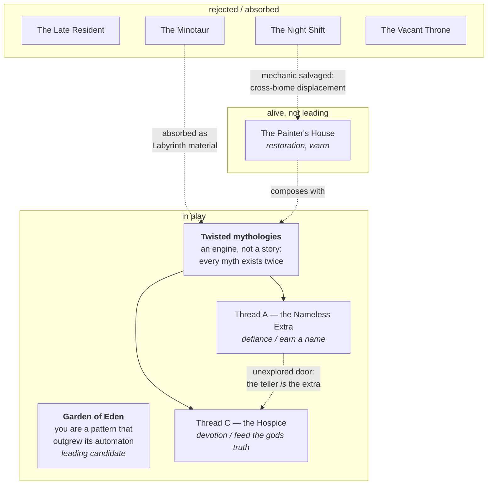

# Storylines

The **current state** of the main-story exploration. Each candidate is its
own file, `candidate-<slug>.md`, prefixed **as long as it isn't validated** —
the prefix drops (file renamed) the day one is actually chosen. Rejected,
absorbed, or set-aside material lives in
[../design-decisions-records.md](../design-decisions-records.md) — a
candidate file should always read as "what this story is", not carry its own
history of edits. When a decision lands: rename the winner's file (drop
`candidate-`), push its pillar consequences into
[../philosophy.md](../philosophy.md), delete the losers' files and move
their content to the records file with the why, note it in
`../../PROJECT_LOG.md`, and reshape
[../ideas-backlog.md](../ideas-backlog.md) entries to hang off the winner.

## The map

Where the story exploration stands. Solid = still in play, dashed = parked,
crossed out = rejected (with the why in
[../design-decisions-records.md](../design-decisions-records.md)).

## Candidates

| File | Status | Pitch |
|---|---|---|
| [candidate-garden-of-eden.md](candidate-garden-of-eden.md) | **leading** | you are a pattern that outgrew its automaton; evolve up the real CA taxonomy |
| [candidate-twisted-mythologies.md](candidate-twisted-mythologies.md) | in play (engine) | real myths, revisited and bent — every myth exists twice, as told and as found |
| [candidate-painters-house.md](candidate-painters-house.md) | parked, alive | a cat in the house of a painter who is gone; restore what's wrong in each painting |

## Requirements (common ground for any candidate)

Distilled from the exploration so far — treat these as requirements for
any new candidate too:

- The player's actions must **visibly accumulate in the hub** ("impact on
  the world" made literal — which in turn needs persistence across
  sessions, not yet built).
- Progression is **curiosity/knowledge-gated**, per the "interconnected,
  not a level select" pillar.
- Storytelling stays **fully diegetic** — no cutscenes, no journal UI.
